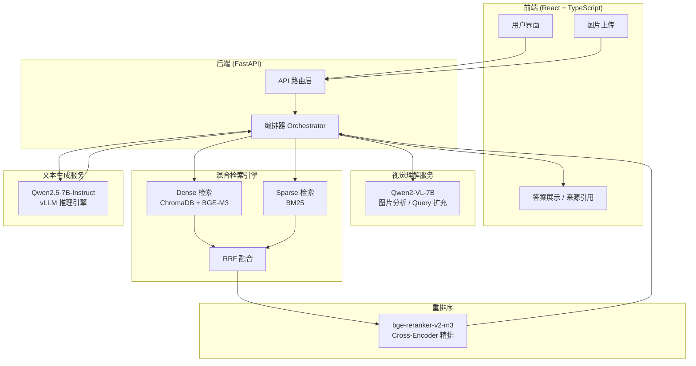
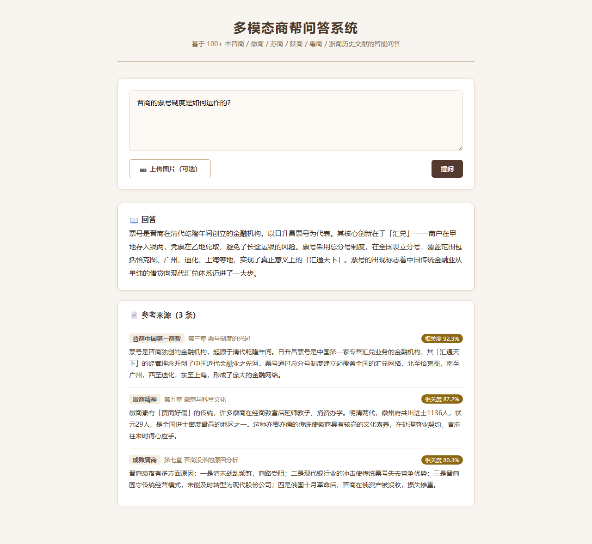
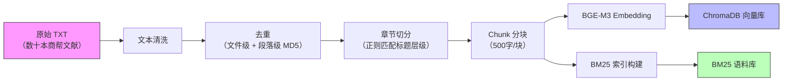
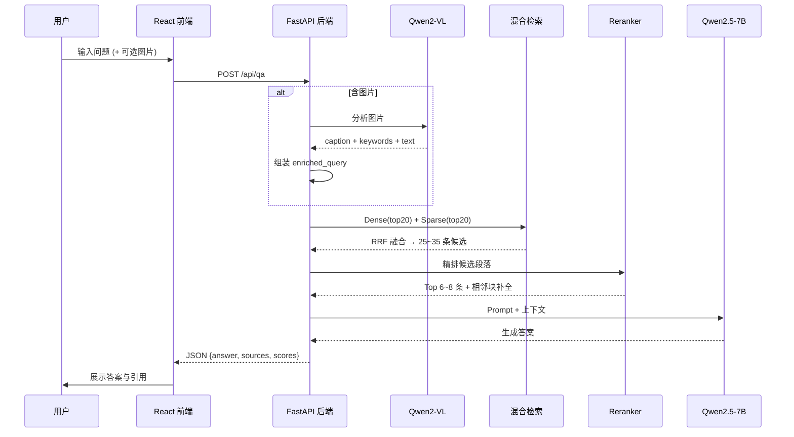

# 多模态商帮问答系统

> Multimodal Merchant Group Q&A System — 基于历史商帮文献的智能问答系统

基于 **RAG（检索增强生成）** 架构的商帮历史文化智能问答系统。整合晋商、徽商、苏商、陕商、粤商、浙商等数十本历史文献，通过**混合检索 + 重排序 + 多模态理解 + 大语言模型生成**，实现准确、有据可查的商帮文化知识问答。

---

## 系统架构



---

## 核心特性

## 界面预览



---

- **混合检索** — Dense (BGE-M3 语义向量) + Sparse (BM25 关键词) 双路召回，RRF 加权融合，兼顾语义相似与精确匹配
- **Cross-Encoder 重排序** — bge-reranker-v2-m3 对候选段落深度打分，提升 Top 结果精度
- **多模态理解** — Qwen2-VL-7B 分析用户上传图片，提取描述/文字/关键词，增强检索 Query
- **上下文补全** — 命中 Chunk 自动补全相邻块，避免分块导致的语义断裂
- **来源可追溯** — 每个答案附带来源文献、章节、相关度分数

---

## 技术栈

| 层级 | 技术 | 说明 |
|------|------|------|
| **前端** | React + TypeScript + Axios | 组件化 UI，类型安全，HTTP 通信 |
| **后端框架** | FastAPI (Python) | 异步、高性能、自动 OpenAPI 文档 |
| **文本生成** | Qwen2.5-7B-Instruct + vLLM | PagedAttention 高吞吐推理，OpenAI 兼容 API |
| **视觉理解** | Qwen2-VL-7B-Instruct + LMDeploy | 多模态图片分析，输出结构化描述 |
| **Dense 检索** | ChromaDB + BGE-M3 | 向量语义检索，Embedding 维度 1024 |
| **Sparse 检索** | BM25 (rank_bm25) | 关键词精确匹配，专有名词不遗漏 |
| **重排序** | bge-reranker-v2-m3 | Cross-Encoder 架构，(Query, Doc) 联合打分 |
| **融合算法** | RRF (Reciprocal Rank Fusion) | 多路召回结果加权合并 |

---

## 数据处理 Pipeline



### 清洗步骤
1. 统一编码为 UTF-8
2. 去除连续空行、无意义乱码和特殊符号
3. 去除明显页码、页眉页脚
4. 去除目录页、版权页等非正文内容
5. 输出干净文本 + metadata（book_id, book_title, merchant_group 等）

### 去重策略
- **文件级粗去重**：按文件名 + 文件大小初步判断同书不同版本、上下册重叠
- **段落级精确去重**：MD5 Hash 去重，仅删除完全相同的段落

### 分块策略
- 先按**章节**切分（正则匹配 "第X章" "第X节" 等标题模式）
- 再按 **500字/块** 做检索块切分
- 每条 Chunk 记录：`chunk_id, book_title, chapter_title, section_title, text, chunk_order`

---

## Q&A 请求链路



---

## 项目结构

```
multimodal-merchant-qa/
├── README.md                       # 项目说明
├── 开发大致流程.md                    # 详细设计文档
├── .gitignore
├── backend/
│   ├── app/
│   │   ├── main.py                 # FastAPI 入口
│   │   ├── config.py               # 配置管理
│   │   ├── routers/
│   │   │   ├── qa.py               # 问答接口
│   │   │   └── upload.py           # 图片上传接口
│   │   ├── services/
│   │   │   ├── orchestrator.py     # 流程编排
│   │   │   ├── retriever.py        # 混合检索 + RRF
│   │   │   ├── reranker.py         # Cross-Encoder 重排
│   │   │   ├── llm_client.py       # Qwen2.5-7B 调用
│   │   │   └── image_analyzer.py   # Qwen2-VL 图片理解
│   │   └── utils/
│   │       ├── text_cleaner.py     # 文本清洗
│   │       └── chunking.py         # 章节/Chunk 切分
│   ├── requirements.txt
│   └── Dockerfile
├── frontend/
│   ├── src/
│   │   ├── App.tsx
│   │   └── api.ts
│   └── package.json
└── data/
    ├── raw_txt/                    # 原始商帮文献 (gitignored)
    ├── cleaned/                    # 清洗后文本 (gitignored)
    └── chroma_db/                  # 向量库持久化 (gitignored)
```

---

## 模型部署

### Qwen2.5-7B-Instruct（文本生成）

```bash
pip install vllm

vllm serve Qwen/Qwen2.5-7B-Instruct \
    --host 0.0.0.0 \
    --port 8000 \
    --dtype bfloat16 \
    --max-model-len 8192 \
    --gpu-memory-utilization 0.9 \
    --api-key your-api-key-here
```

### Qwen2-VL-7B-Instruct（视觉理解）

```bash
pip install lmdeploy qwen_vl_utils

# 通过 FastAPI 封装为 /analyze_image 接口
# 内部使用 LMDeploy pipeline 进行多模态推理
```

---

## 语料说明

本项目知识库涵盖以下商帮历史文献：

| 商帮 | 文献数量 | 内容方向 |
|------|----------|----------|
| 晋商 | 12 本 | 票号制度、北路贸易、诚信文化、兴衰案例分析 |
| 徽商 | 60+ 本 | 宗族社会、儒学伦理、明清经营、发展报告 |
| 其他商帮 | 30+ 本 | 苏商、陕商、粤商、浙商、赣商等 |

> 语料为公开出版的历史研究文献，仅用于学术研究与技术验证。

---

## 快速开始

> 代码实现中，敬请期待。

```bash
# 1. 克隆仓库
git clone https://github.com/tianxinlin666/multimodal-merchant-qa.git
cd multimodal-merchant-qa

# 2. 安装后端依赖
cd backend
pip install -r requirements.txt

# 3. 启动模型服务（需 GPU）
# Qwen2.5-7B 文本生成
vllm serve Qwen/Qwen2.5-7B-Instruct --port 8000
# Qwen2-VL 视觉理解
python -m app.services.image_analyzer --port 8001

# 4. 启动后端 API
uvicorn app.main:app --reload --port 8080

# 5. 启动前端
cd ../frontend
npm install && npm run dev
```

---

## License

MIT License
